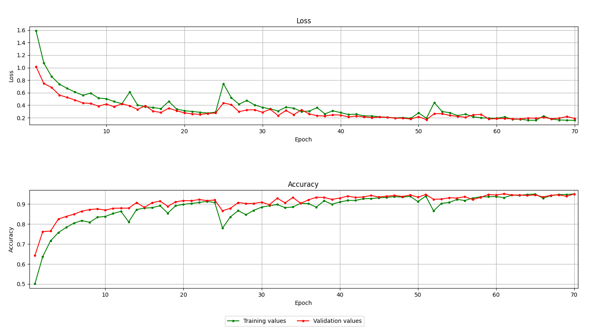
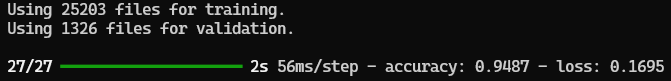

# PC parts network

Neural network based on Tensorflow, that classifies images of PC parts.

This repository is a project for Artificial Intelligence classes on my university, conducted by dr inż. Jacek Paluszak ([@palushak](https://github.com/palushak)).

## Classes

Neural network can recognize following classes of images:

- case
- cpu
- gpu
- monitor
- motherboard
- mouse
- powerSupply
- ram
- speakers

## Installation

Python version 3.11.5 is required for installation.

### Linux/MacOS

```shell
git clone https://github.com/Array221/pcparts-network
cd pcparts-network

python3 -m venv .venv
source .venv/bin/activate
pip install -r requirements.txt
```

### Windows:

```powershell
git clone https://github.com/Array221/pcparts-network
cd pcparts-network

python -m venv .venv
.\.venv\Scripts\Activate.ps1
pip install -r .\requirements.txt
```

## Usage

There are a few commands implemented in this script. To run script command, you have to type:

```shell
python pcpartsnet.py <commandName>
```

List of all commands can be displayed by using global help menu:

```shell
python pcpartsnet.py --help
```

Every command has it's own builtin help page that can be accessed by typing:

```shell
python pcpartsnet.py <commandName> --help
```

For example, typing:

```shell
python pcpartsnet.py train --help
```

You will display `train` command help page.

## Pre-trained weights file

Pre-trained weights file is available in [Releases section of this repository](https://github.com/Array221/pcparts-network/releases/latest).

It was trained on [pc parts dataset](https://www.kaggle.com/datasets/anasahmedmohamed/pc-parts-dataset) from Kaggle and some pictures found in the internet.

### Training details

Here's training chart, that shows how accuracy and loss values was changing during training:



Training has been ended on epoch **51**, resulting in **0.9487** accuracy and **0.1695** loss.


